# RLmalloc

**English** | [中文](README.zh-CN.md)

A reinforcement-learning study of **dynamic memory allocation**: a DQN agent
chooses which free block to allocate from, guided by a reward that encourages a
*concentrated* free space. It is benchmarked against the classic First-Fit,
Best-Fit and Worst-Fit policies on four request distributions.

> **Honest status.** The learned policy is a **modest, partly negative**
> result. It roughly matches First-Fit, is clearly **worse than Best-Fit** on
> occupancy / duration / fragmentation, and only clearly beats Worst-Fit. It is
> *not* a better allocator than Best-Fit. [Section 7](#7-honest-assessment-weaknesses-and-likely-causes)
> states the weaknesses and the likely reasons; nothing is tuned to look
> better. Every number and figure in this repository is produced by the code
> in this repository.

## Contents

1. [What this project is](#1-what-this-project-is)
2. [Results at a glance](#2-results-at-a-glance)
3. [Method](#3-method)
4. [Repository layout](#4-repository-layout)
5. [Install](#5-install)
6. [Quickstart](#6-quickstart)
7. [Reproduce the full results](#7-reproduce-the-full-results)
8. [Honest assessment: weaknesses and likely causes](#8-honest-assessment-weaknesses-and-likely-causes)
9. [Metrics (and how HHI is defined)](#9-metrics-and-how-hhi-is-defined)
10. [Testing](#10-testing)
11. [Documentation map](#11-documentation-map)
12. [License](#12-license)

---

## 1. What this project is

A simulated allocator arena (4096 bytes) processes a stream of allocation
requests and random frees. At each step the environment exposes a small set of
**candidate free blocks** (the first `k = 5` that fit the request, ordered by
start address) and the DQN picks one. The reward is the *Herfindahl–Hirschman
index* (HHI) of the free space, which is high when free bytes are concentrated
in a few large blocks (healthy) and low when they are scattered (fragmented).

The study asks a simple question: **can a learned, non-greedy placement policy
stay competitive with hand-written heuristics?** The measured answer in this
repository is: *partially — it is comparable to First-Fit, but it does not beat
Best-Fit.*

## 2. Results at a glance

All figures below are generated by `rlmalloc.evaluate` / `rlmalloc.plotting`
into [`results/figures/`](results/figures/).

### 2.1 Training

Training request sizes (median 32 B, right-skewed), and the learning curve of
the full 10 000-episode run:

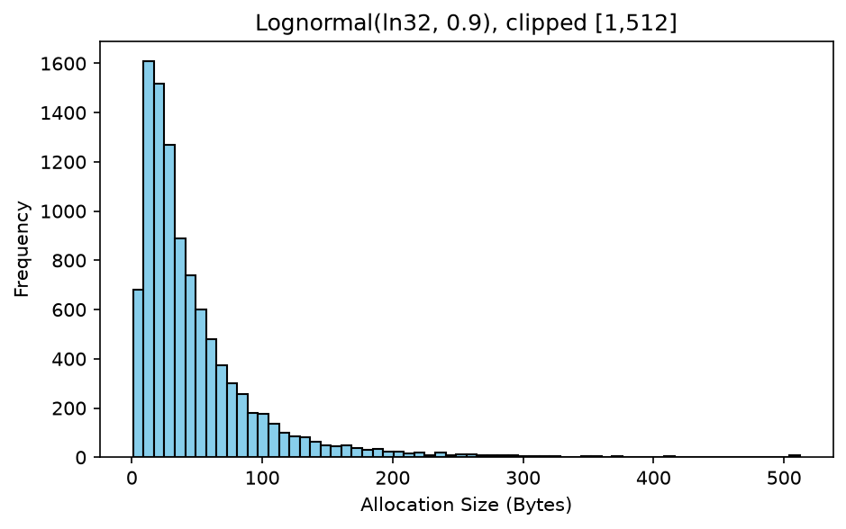
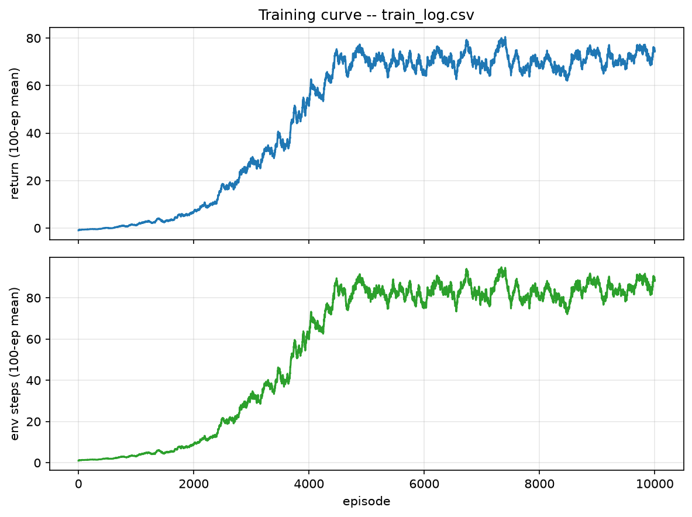

The agent does learn: the mean return of the last 100 episodes is **74.35**
(up from ≈ −1 early, when random exploration hits invalid actions).

### 2.2 Evaluation workloads

Four request distributions are used to probe robustness:

| Training distribution | Large requests | Uniform | Bimodal |
|---|---|---|---|
| 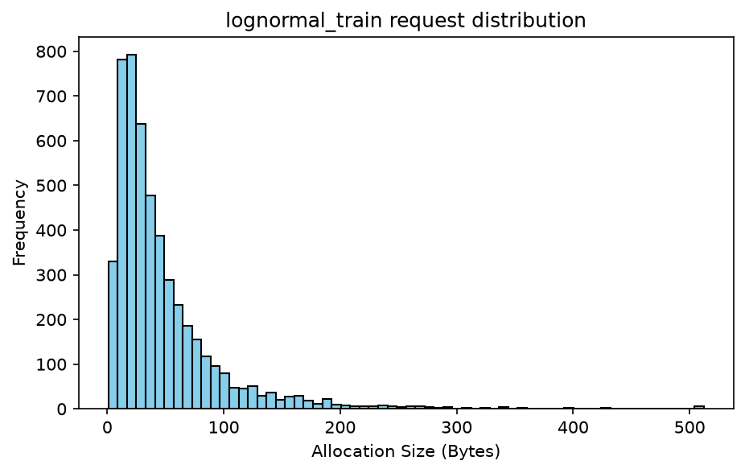 | 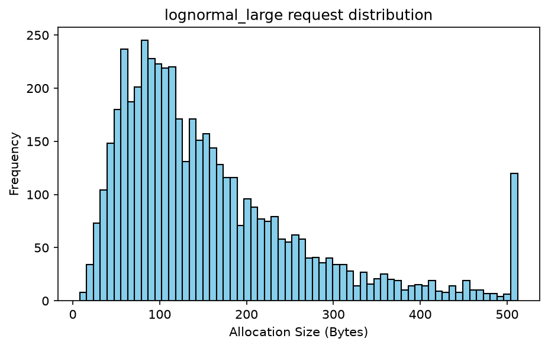 | 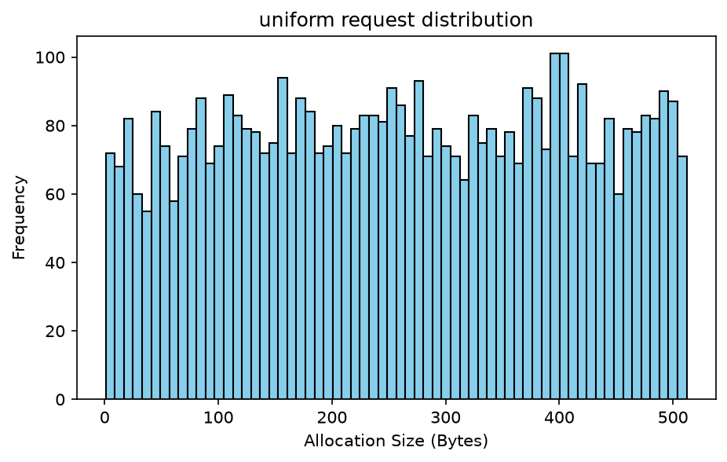 | 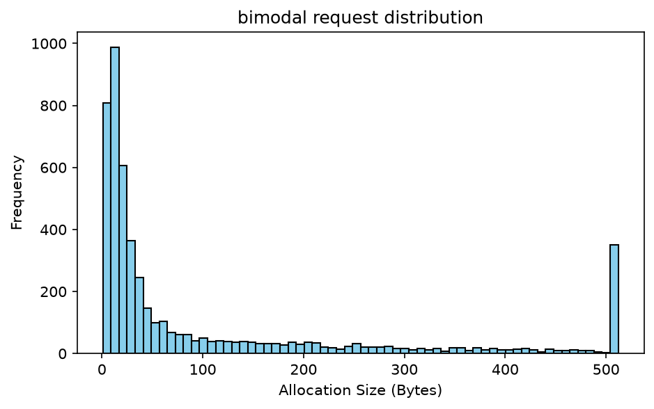 |

### 2.3 Policy comparison across distributions

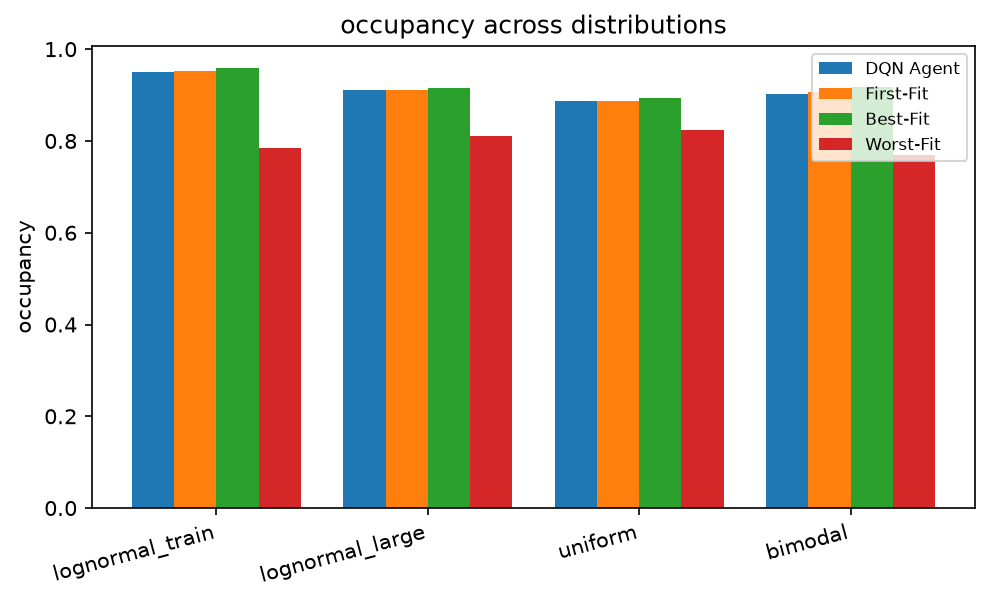
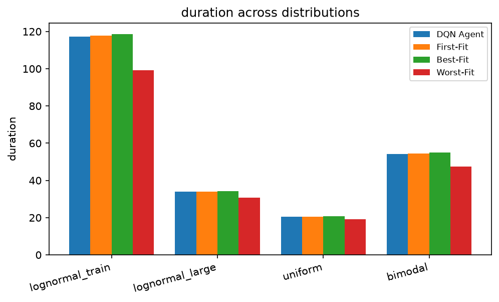
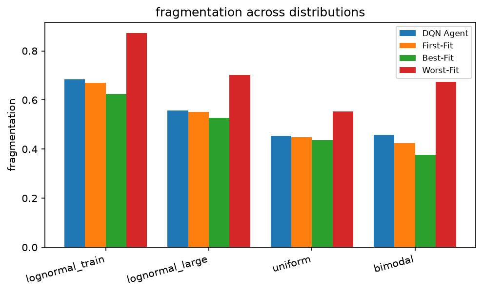
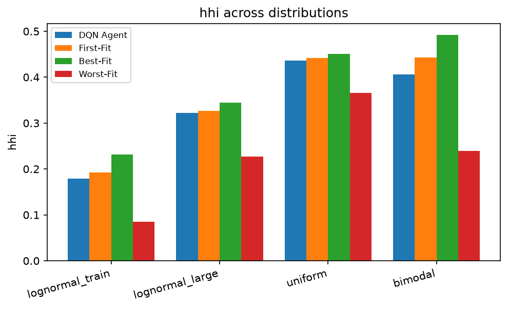

Per-distribution 2×2 breakdowns (occupancy / duration / fragmentation / HHI):

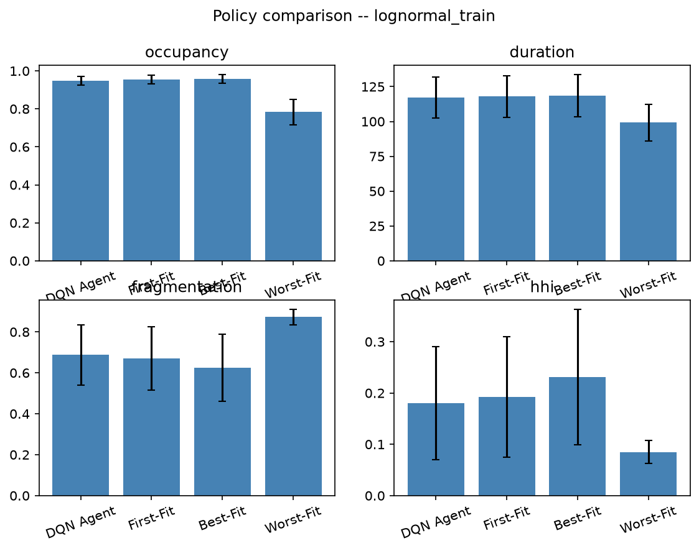

### 2.4 Results table

Mean over 1000 evaluation rounds per distribution (no error bars — see
[Section 8](#8-honest-assessment-weaknesses-and-likely-causes)). Raw table:
[`results/tables/summary.md`](results/tables/summary.md).

| distribution | policy | occupancy | duration | fragmentation | hhi |
|---|---|---|---|---|---|
| lognormal_train | DQN Agent | 0.9489 | 117.28 | 0.6882 | 0.1798 |
| lognormal_train | First-Fit | 0.9535 | 117.86 | 0.6701 | 0.1921 |
| lognormal_train | Best-Fit | 0.9588 | 118.59 | 0.6239 | 0.2311 |
| lognormal_train | Worst-Fit | 0.7838 | 99.22 | 0.8723 | 0.0851 |
| lognormal_large | DQN Agent | 0.9098 | 33.97 | 0.5538 | 0.3230 |
| lognormal_large | First-Fit | 0.9111 | 33.99 | 0.5504 | 0.3262 |
| lognormal_large | Best-Fit | 0.9152 | 34.14 | 0.5277 | 0.3449 |
| lognormal_large | Worst-Fit | 0.8115 | 30.84 | 0.7015 | 0.2269 |
| uniform | DQN Agent | 0.8857 | 20.52 | 0.4581 | 0.4321 |
| uniform | First-Fit | 0.8879 | 20.59 | 0.4483 | 0.4419 |
| uniform | Best-Fit | 0.8929 | 20.71 | 0.4366 | 0.4508 |
| uniform | Worst-Fit | 0.8239 | 19.22 | 0.5529 | 0.3654 |
| bimodal | DQN Agent | 0.9026 | 54.19 | 0.4558 | 0.4080 |
| bimodal | First-Fit | 0.9064 | 54.45 | 0.4237 | 0.4425 |
| bimodal | Best-Fit | 0.9176 | 55.03 | 0.3768 | 0.4921 |
| bimodal | Worst-Fit | 0.7701 | 47.55 | 0.6734 | 0.2389 |

**Reading the table.** Best-Fit has the best occupancy, longest duration and
lowest fragmentation on every distribution; Worst-Fit is worst on all three.
The DQN sits between them, close to (very slightly below) First-Fit. On the
free-space concentration metric (HHI) the ordering is the same: Best-Fit >
First-Fit > DQN > Worst-Fit. In short, **the agent learned a reasonable policy
but did not surpass the classical best heuristic.**

## 3. Method

| Element | Design |
|---|---|
| State | `2k+1 = 11` floats: `k=5` candidate blocks as `[size/M, start/M]` pairs, then `request/M` |
| Action | index into the candidate set, `0..k-1` |
| Candidate set | free blocks sorted by start address ascending, first `k` with `size >= request` |
| Reward | HHI of the free list: `Σ(lᵢ/S_total)² ∈ [0,1]` |
| Invalid action | reward `-1.0` **and** episode terminates |
| Network | `11 → 128 → ReLU → 128 → ReLU → 5` MLP |
| Learning | DQN: replay (`C=10000`), target network (`T=50` steps), SmoothL1, Adam (`lr=1e-4`) |

State construction and action decoding share one function
(`rlmalloc/candidates.py::build_candidates`), so the candidate the agent *sees*
is exactly the candidate its action *selects*. Full details:
[`docs/METHOD.md`](docs/METHOD.md).

## 4. Repository layout

```
RLmalloc/
├── README.md  README.zh-CN.md          # English / 中文
├── LICENSE
├── requirements.txt  requirements-dev.txt  environment.yml
├── conftest.py
├── config.py agent.py env.py utils.py main.py test.py   # legacy import shims
├── docs/
│   ├── METHOD.md  METHOD.zh-CN.md
│   ├── DESIGN.md  DESIGN.zh-CN.md
│   ├── REPRODUCE.md  REPRODUCE.zh-CN.md
│   └── assets/architecture.txt
├── rlmalloc/                           # the actual package
│   ├── config.py candidates.py env.py workloads.py
│   ├── policies.py metrics.py agent.py
│   └── train.py evaluate.py plotting.py utils.py
├── scripts/{train_quick.sh, train_full.sh, evaluate.sh}
├── tests/{test_candidates,test_env,test_metrics,test_workloads}.py
└── results/
    ├── README.md  metrics.json
    ├── checkpoints/  metrics/  tables/  figures/  original/
```

## 5. Install

Every command in this README runs inside an **isolated conda/mamba environment
`test-py312`** (Python 3.12). This keeps the project from touching any other
Python environment.

```bash
# dependencies are already present in test-py312; re-install / re-pin with:
micromamba run -n test-py312 pip install -r requirements.txt
micromamba run -n test-py312 pip install -r requirements-dev.txt
```

Recreate an equivalent environment from scratch elsewhere:

```bash
micromamba env create -f environment.yml   # creates env `test-py312`
```

> `environment.yml` pins `torch==2.14.0`; on the reference machine this
> resolves to a CUDA build (`2.14.0+cu130`). Swap in a CPU wheel if you do not
> need GPU training.

## 6. Quickstart

```bash
cd /home/yangsch/RLmalloc

# unit tests (fast)
micromamba run -n test-py312 python -m pytest -q tests

# bounded smoke training (~2 s on CPU; NOT a trained policy)
micromamba run -n test-py312 python -m rlmalloc.train \
  --dist lognormal_train --episodes 300 --max-steps 200 --learn-every 2 \
  --seed 0 --device cpu \
  --out results/checkpoints/agent_quick \
  --log results/metrics/train_log_quick.csv

# bounded evaluation using that checkpoint
micromamba run -n test-py312 python -m rlmalloc.evaluate \
  --checkpoint results/checkpoints/agent_quick --seed 0 --device cpu \
  --rounds 20 --requests 200 --release-rate 0.3 \
  --dists lognormal_train lognormal_large uniform bimodal \
  --out-metrics results/metrics --out-tables results/tables \
  --figures results/figures
```

## 7. Reproduce the full results

```bash
# Full training: 10 000 episodes. GPU recommended; on CPU this is hours.
micromamba run -n test-py312 python -m rlmalloc.train \
  --dist lognormal_train --episodes 10000 --max-steps 2000 \
  --seed 0 --device cuda \
  --out results/checkpoints/agent --log results/metrics/train_log.csv

# Full evaluation: 4 policies x 4 distributions x 1000 rounds
micromamba run -n test-py312 python -m rlmalloc.evaluate \
  --checkpoint results/checkpoints/agent --seed 0 --device cpu \
  --rounds 1000 --requests 200 --release-rate 0.3 \
  --dists lognormal_train lognormal_large uniform bimodal \
  --out-metrics results/metrics --out-tables results/tables \
  --figures results/figures
```

Reference timings on this machine (RTX 5060 Laptop GPU + CPU): full training
**≈ 21.3 min** (`episodes=10000 steps=568654`), full evaluation **≈ 22 s**.
Exact commands, outputs and artifact list:
[`docs/REPRODUCE.md`](docs/REPRODUCE.md).

## 8. Honest assessment: weaknesses and likely causes

The result is **weaker than hoped** and it is worth saying so plainly:

* **It never beats Best-Fit.** On every distribution and every classical
  metric (occupancy, duration, fragmentation), Best-Fit is better.
* **It barely beats First-Fit — sometimes not at all.** On the training
  distribution First-Fit even has slightly lower fragmentation
  (0.6701 vs 0.6882).
* **It only clearly beats Worst-Fit**, which is not a high bar.
* **Single seed, no error bars.** The DQN↔First-Fit gaps (~0.003–0.005
  occupancy) are small enough that they may not be significant; we did not run
  multiple seeds, so we do not claim a directional advantage either way.

**Likely causes (most to least important):**

1. **The action space is restricted.** The DQN can only choose among the first
   `k = 5` fitting blocks (by address), while the heuristics scan *all* free
   blocks. Best-Fit's globally best block is frequently **not in the candidate
   set**, so the agent cannot represent the choice that makes Best-Fit good.
   This is probably the dominant limitation.
2. **The reward is a proxy, not the objective.** Learning maximizes HHI
   (concentration), but we *evaluate* occupancy / duration / fragmentation.
   Optimizing a smooth concentration surrogate does not guarantee the best
   occupancy.
3. **Limited observability.** The state encodes only the `k` candidates and the
   current request — no global free-list statistics (count, total free bytes,
   largest block) and no history. The agent cannot reason about the arena as a
   whole the way a heuristic effectively does.
4. **Distribution shift.** Training uses one workload; the other three are
   out-of-distribution and the learned policy transfers only partially.
5. **Untuned optimization.** The learning rate, epsilon schedule and episode
   count were chosen by hand, not searched; a single seed gives no variance
   estimate, so small gaps may be noise.
6. **Exploration cost.** Invalid actions end the episode with reward `-1`, so
   early random exploration is expensive and can bias learning.

These are design limitations of the current framing, not bugs; concrete
suggestions for future work are listed in
[`docs/DESIGN.md`](docs/DESIGN.md).

## 9. Metrics (and how HHI is defined)

All metrics are computed on the end-of-round free list.

| Metric | Formula | Direction |
|---|---|---|
| Occupancy | `1 − S_total/M` | higher better |
| Duration | number of successful allocations | higher better |
| Fragmentation | `1 − max(lᵢ)/S_total` | lower better |
| HHI | `Σ(lᵢ/S_total)²` | higher = more concentrated |

**HHI.** `HHI = Σ(lᵢ/S_total)²` is the Herfindahl–Hirschman index applied to
the free-block size shares, and it is defined **once** in the whole project
(`rlmalloc/metrics.py`). It answers "how concentrated is the free space?":

* **Range:** for `N` free blocks, `1/N ≤ HHI ≤ 1`. One single free block →
  `HHI = 1`; `N` equal blocks → `HHI = 1/N`; no free memory → `HHI = 0`.
* **Direction:** higher is healthier (free space concentrated in a few large
  blocks). It is bounded by the largest free share, which equals
  `1 − Fragmentation`, so `HHI ≤ 1 − Fragmentation`.
* **Why Worst-Fit has the *lowest* HHI:** Worst-Fit always allocates from the
  largest free block, progressively flattening the free list into many
  similarly sized medium blocks (largest share ≈ 0.13 vs ≈ 0.34–0.37 for
  First-/Best-Fit). Near-equal shares minimise `Σsᵢ²`, hence the lowest HHI.

## 10. Testing

```bash
micromamba run -n test-py312 python -m pytest -q tests
# -> 22 passed
```

The suite covers the candidate-ordering invariant (state and action agree),
terminal invalid actions, duration counting, workload/free-ordinal validity,
and the metric definitions (including the `HHI ≤ 1 − Fragmentation` bound).

## 11. Documentation map

| Document | Contents |
|---|---|
| [`docs/METHOD.md`](docs/METHOD.md) | Environment, MDP, network, training, workloads |
| [`docs/DESIGN.md`](docs/DESIGN.md) | Design choices, assumptions, limitations, future work |
| [`docs/REPRODUCE.md`](docs/REPRODUCE.md) | Exact commands, timings, artifact list |
| [`results/README.md`](results/README.md) | Catalog of every generated artifact |
| 中文 | [`README.zh-CN.md`](README.zh-CN.md), `docs/*.zh-CN.md` |

## 12. License

MIT — see [`LICENSE`](LICENSE).
